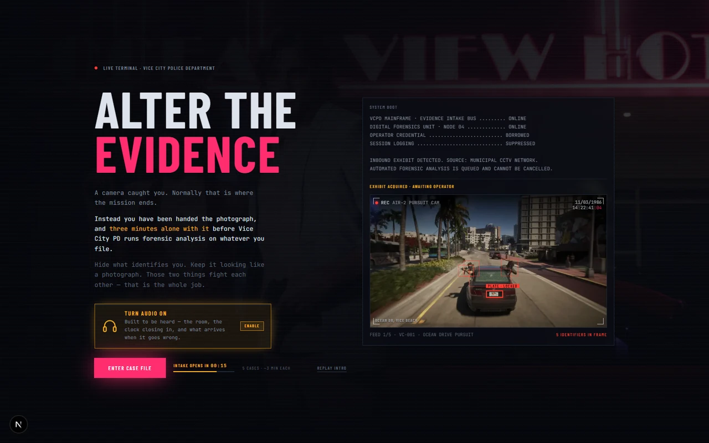
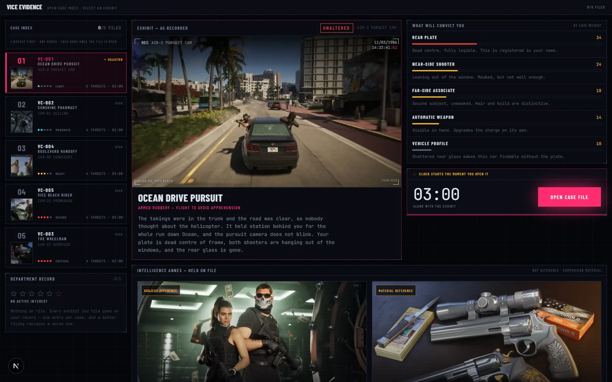
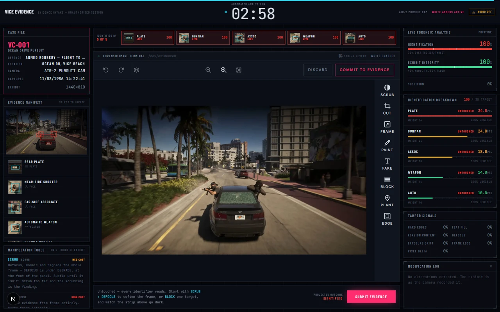
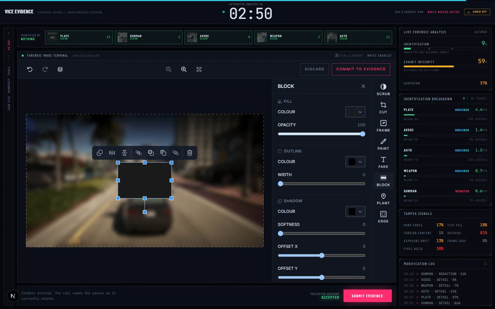
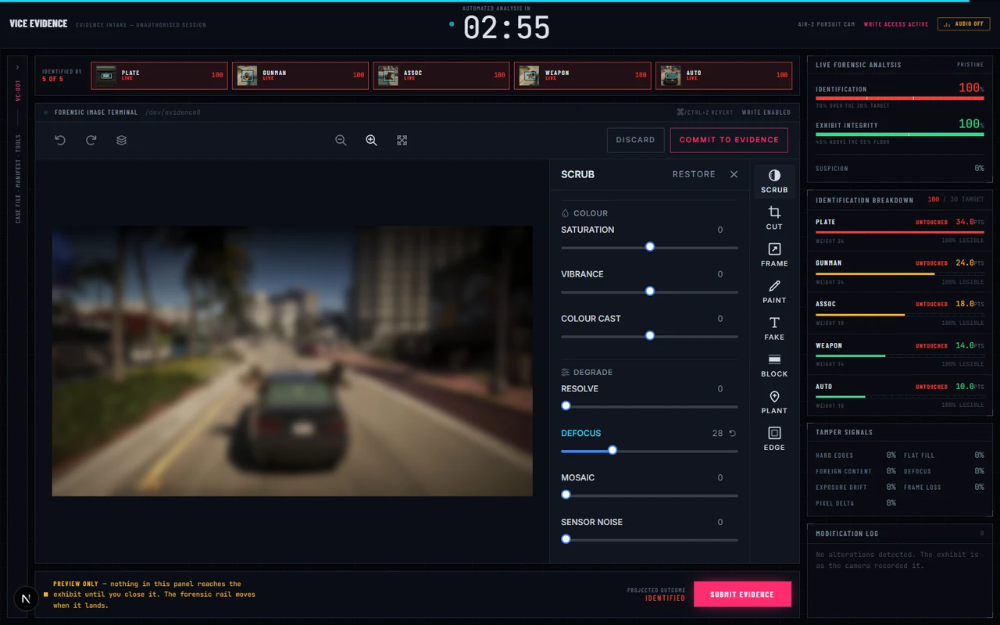
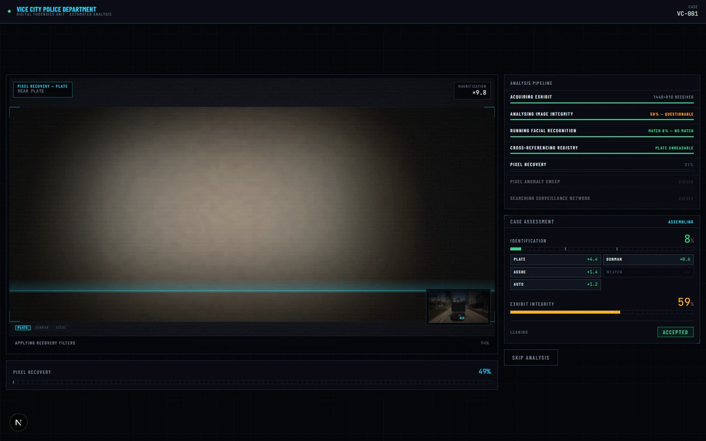
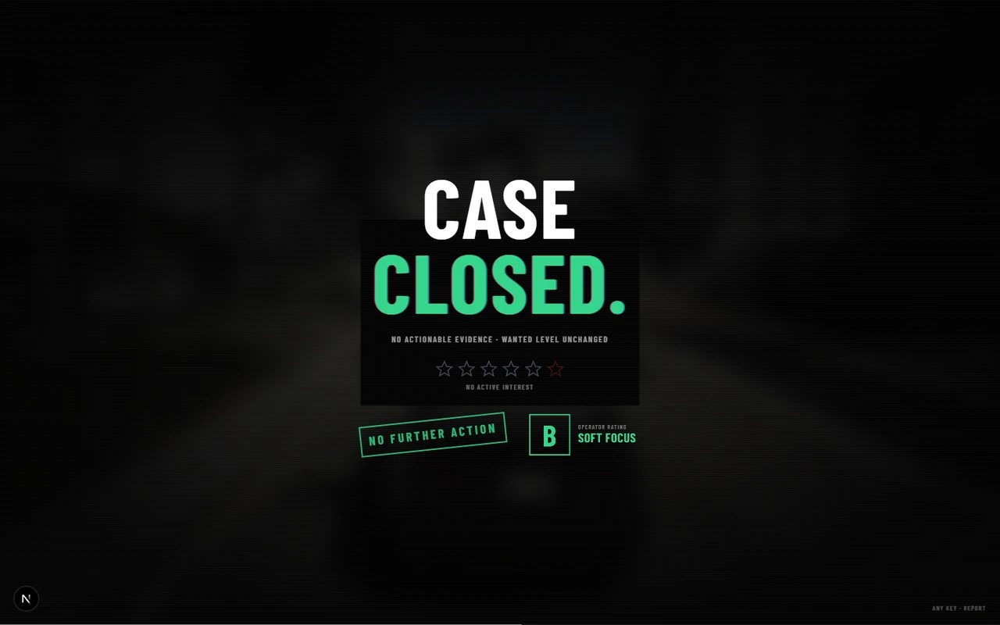
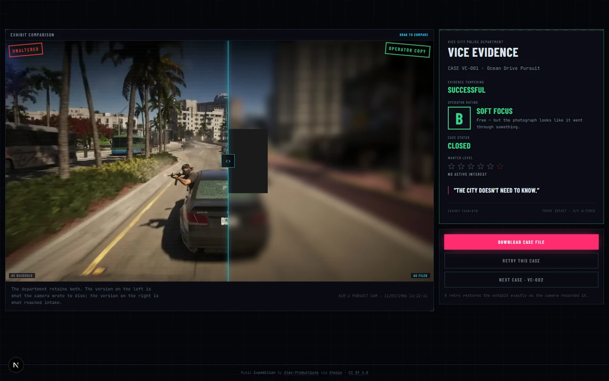
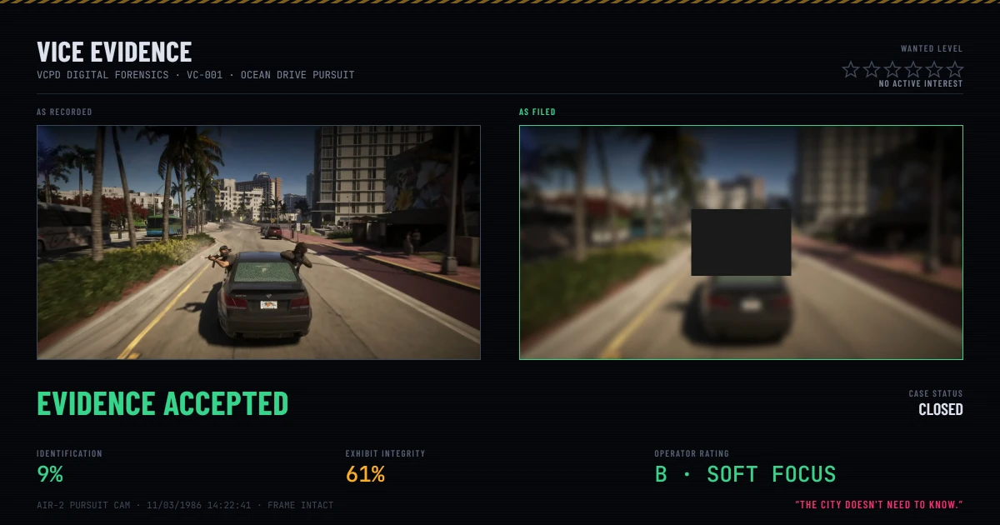

<div align="center">

# VICE EVIDENCE

### A camera caught you. You have three minutes to alter the evidence.

Built for the **Build with React Image Editor Challenge** — a GTA VI‑inspired
experience where [`@unlayer/react-image-editor`](https://github.com/unlayer/react-image-editor)
isn't a feature bolted onto a product. It **is** the game.

<a href="https://franksignorini.github.io/unlayer-contest-gta-image-editor/">
  
</a>

**🎮 Fully playable at [franksignorini.github.io/unlayer-contest-gta-image-editor](https://franksignorini.github.io/unlayer-contest-gta-image-editor/) — no install, just click and play.**

<br/>

[](https://nextjs.org/)
[](https://react.dev/)
[](https://www.typescriptlang.org/)
[](https://tailwindcss.com/)
[](https://franksignorini.github.io/unlayer-contest-gta-image-editor/)

<br/>



</div>

---

## Challenge submission checklist

Built for Unlayer's **[Build with React Image Editor Challenge](https://github.com/unlayer/react-image-editor)** (#BuiltWithImageEditor):

| Requirement | This project |
|---|---|
| A GTA VI-inspired experience | ✅ Vice City, 1986 — VCPD digital forensics, built from original UI, not copied chrome |
| React Image Editor as a **core** part of the project | ✅ It's not a feature — it *is* the only verb set the game gives you. See [How React Image Editor is used](#how-react-image-editor-is-used) |
| Users can edit/customise at least one visual | ✅ Every one of five surveillance photographs, with all eight of the editor's tools re-skinned into the fiction |
| Public GitHub repo | ✅ You're in it |
| Deployed | ✅ **[Live on GitHub Pages](https://franksignorini.github.io/unlayer-contest-gta-image-editor/)**, static export, auto-deployed on every push |

## What is this?

Every crime game punishes you with **MISSION FAILED** the moment a camera
catches you. **Vice Evidence** hands you the photograph instead, and a clock:

> A CCTV camera on Vice City PD's network just caught you mid-crime. Before
> automated forensics run, you have **three minutes alone with the exhibit** in
> a police image editor you were never supposed to have access to. Hide what
> identifies you. Keep the photograph looking like a photograph. Those two
> goals fight each other, and that fight is the entire game.

The image editor **is** the verb set — there is no separate "gameplay" bolted
onto it. Crop, blur, redact, paint, plant a sticker, forge a caption: every
tool in the rail is a real `@unlayer/react-image-editor` tool, re-skinned into
the fiction, and every one of them is a way to tamper with a photograph.

And unlike most "edit an image" demos, the game does not trust *which buttons
you pressed*. It re-analyses the **actual pixels you submit**, frame by frame,
the same way a real forensic pass would — so what happens next genuinely
follows from what you did to the image, not from a script.

|                                    | Hides your identity | Still looks authentic         |
| ---------------------------------- | :------------------: | :----------------------------: |
| Solid redaction bar                | ✅ excellent          | ❌ screams "tampered"          |
| Heavy blur (DEFOCUS)               | ✅ good               | 〰️ mediocre                     |
| Crop the witness out                | ✅ total              | ❌ costs frame integrity        |
| Light blur + a well-placed cover    | ✅ enough             | ✅ nearly invisible             |

Smear the whole frame into mush and you get **EVIDENCE TAMPERING DETECTED**.
Submit the capture untouched and you get **IDENTIFICATION CONFIRMED**. Good
play is knowing exactly which piece of evidence actually convicts you *in this
case*, and spending a limited "how obvious was this edit" budget only there.

## How React Image Editor is used

Not a screenshot of it, not one filter borrowed from it — the running
`@unlayer/react-image-editor` instance *is* the terminal screen, mounted full
size, driven only through its documented, supported API:

- **All eight tools on the rail are real editor tools**, renamed into the
  fiction through the `translations` option — nothing is faked or drawn on
  top. `filter` → `SCRUB` (blur, mosaic, grade), `crop` → `CUT`, `resize` →
  `FRAME`, `draw` → `PAINT`, `text` → `FAKE`, `shapes` → `BLOCK`, `stickers` →
  `PLANT`, and a per-tool custom icon set so the rail reads as police
  equipment rather than a stock toolbar. See
  [`src/components/editor/editor-config.ts`](src/components/editor/editor-config.ts).
- **The editor's own Save is the game's Save.** `COMMIT TO EVIDENCE` is the
  editor's native save button, relabelled — pressing it *is* submitting your
  case. Its `DISCARD` action is wired to `editor.reset()` through the
  library's own `onCancel` callback.
- **Scoring reads the editor's real output**, not which buttons were clicked.
  The library exposes no per-edit events, so `getImage()` is polled for the
  actual exported PNG, and every point of the forensic score — identification,
  integrity, the tamper signals — is computed by re-analysing those pixels
  against the original capture. Blur the photograph outside the game entirely
  and feed the result in through `/forensics-editor` and it scores exactly the
  same way; there is no separate "what you meant to do" channel.
- **Undo, redo, and the live forensic rail all ride the editor's own state** —
  `Ctrl/Cmd+Z` drives its native REVERT/REAPPLY controls (it ships with no
  shortcuts of its own), and a `MutationObserver` on the editor's DOM tells the
  terminal which panel is open and whether a tool's effect has actually landed
  on the canvas yet or is still a live preview.

The full API contract this was built against — including the sharp edges that
aren't in the library's own docs — is written up in
[`src/components/editor/editor-config.ts`](src/components/editor/editor-config.ts)
and the ["Under the hood"](#under-the-hood) section below.

## How to play

1. **Open a case.** Five surveillance stills, each with its own evidence
   targets — a plate, a face, a weapon, a marking — weighted by how much each
   one convicts you.
2. **The clock starts the second you open the file.** Three minutes, no pause.
3. **Work the exhibit** with the eight tools on the rail — `SCRUB`, `CUT`,
   `FRAME`, `PAINT`, `FAKE`, `BLOCK`, `PLANT`, `EDGE` — while a live forensic
   rail reads your actual edits and tells you, in real time, whether you're
   getting away with it.
4. **Submit** (or run out the clock — intake pulls whatever's on the canvas).
5. **Watch VCPD's own forensics unit** — the same software, now working
   against you — take the exhibit apart: facial recognition, plate
   cross-referencing, a pixel-recovery pass that tries to read what you tried
   to hide.
6. **Get a verdict** — closed, suspended, escalated, or a warrant — plus an
   operator grade from `F` to `S`, and a downloadable case card to prove it.

Five cases, four possible outcomes, roughly three minutes each. Your wanted
level and rap sheet persist across your whole run — a botched case isn't
permanent, refiling it better takes stars back off.

## Screenshots

<table>
<tr>
<td width="50%" valign="top">

<br/>
<sub><b>Case select.</b> Every target that will convict you, ranked by weight, before the clock starts — the intelligence annex shows what the department will compare your edit against.</sub>
</td>
<td width="50%" valign="top">

<br/>
<sub><b>The terminal.</b> The exhibit, untouched. Every identifier above the canvas reads <code>LIVE</code> — this is the state VCPD is judging you against.</sub>
</td>
</tr>
<tr>
<td width="50%" valign="top">

<br/>
<sub><b>BLOCK.</b> Cover a target outright with a real shape tool — the forensic rail reacts before the panel even closes: identification collapses, integrity takes the hit.</sub>
</td>
<td width="50%" valign="top">

<br/>
<sub><b>SCRUB → DEFOCUS.</b> Soften the whole photograph instead of covering anything — subtler, but a plainly blurred exhibit is its own kind of evidence.</sub>
</td>
</tr>
<tr>
<td width="50%" valign="top">

<br/>
<sub><b>The turn.</b> The same software reassembles as the police side of it and reads your <em>actual</em> submitted pixels — magnified, live, no dice roll.</sub>
</td>
<td width="50%" valign="top">

<br/>
<sub><b>The verdict.</b> Closed, suspended, escalated, or a warrant — with an operator grade that rewards the careful play over the one-slider play.</sub>
</td>
</tr>
<tr>
<td width="50%" valign="top">

<br/>
<sub><b>The dossier.</b> Drag to wipe between what the camera recorded and what you filed — the one moment you get to admire your own work.</sub>
</td>
<td width="50%" valign="top">

<br/>
<sub><b>The case card.</b> A shareable PNG of the whole run, rendered on canvas — the only way a case leaves the browser.</sub>
</td>
</tr>
</table>

## Run it locally

```bash
npm install
npm run dev
```

Then open <http://localhost:3000>. Desktop is the primary experience — the
terminal is built around a three-column layout.

> The editor loads its toolchain from Unlayer's CDN at runtime, so it needs
> network access. Without it you get a diegetic **"TERMINAL OFFLINE"** state
> instead of a broken page.

## Deployment

The live build at **[franksignorini.github.io/unlayer-contest-gta-image-editor](https://franksignorini.github.io/unlayer-contest-gta-image-editor/)**
is a static export, built and published automatically by
[`.github/workflows/deploy.yml`](.github/workflows/deploy.yml) on every push
to `main` — `next build` with `output: 'export'`, `basePath` set to the repo's
subpath, then `actions/deploy-pages`. See `next.config.ts` and
`src/lib/asset-path.ts` for how every asset URL stays correct under that
subpath without a server behind it.

---

<a id="under-the-hood"></a>

<details>
<summary><b>🔧 Under the hood — for reviewers and other developers</b> (click to expand)</summary>

## The loop

`boot → case select → the terminal → submit → analysis → verdict → dossier`

## What's actually interesting in here

**`src/lib/forensics/`** — the real forensic engine. The library exposes no
per-edit events, so scoring cannot be a tally of tool clicks. Instead the
submitted PNG is compared against the original:

- `analyze.ts` — per-region legibility from gradient-energy ratio, similarity
  and variance collapse; plus whole-frame tamper signals (introduced
  axis-aligned hard edges, flat fills, foreign detail, exposure drift).
- `align.ts` — crop/resize recovery. A cropped submission is matched back onto
  the original by a coarse scale/offset search scored with zero-mean normalised
  correlation, so evidence boxes are followed into the new frame (or correctly
  reported as cropped out).
- `score.ts` — every tunable number lives in one `SCORING` object, plus the
  outcome matrix.

**`src/components/editor/editor-config.ts`** — the editor re-skinned entirely
through its own supported surface. Every tool and toolbar action is renamed into
the fiction via `translations`: SCRUB, CUT, BLOCK, PLANT, FAKE, and Save becomes
`COMMIT TO EVIDENCE`. The editor's own DISCARD is wired to its `onCancel` and
wipes the exhibit back to the capture after a confirmation in the submit bar.

**`src/components/editor/useLiveForensics.ts`** — reads `getImage()` while you
edit, so the forensic rail reacts to real pixels as each operation commits.
Reading is not free — once the canvas holds a single edit, every call
re-renders and re-encodes the whole exhibit (~50ms), so reads are driven by
your actual input (a release, a click, a key) rather than a blind interval,
and stop entirely a few seconds after you go idle.

**`src/components/editor/useToolPanel.ts`** — the editor reports nothing about
its own panels, so this watches them: which tool is open (read from the heading
the editor renders out of our own translation), and whether its work has landed
yet. BLOCK, PAINT, FAKE and PLANT land at once; SCRUB, CUT, FRAME and EDGE are
previews until the panel closes — and the terminal says which, and folds the
case rail away while a panel is open so the exhibit keeps its size.

**`src/components/editor/FilingOverlay.tsx`** — the handoff. Submitting
freezes the terminal under a scrim, stamps **EXHIBIT FILED**, and the screen
collapses like an old CRT to a line and a point; the analysis screen powers up
out of that same line. The turn the whole game is built around gets an actual
beat instead of a hard cut.

**`/forensics-check`** (dev only) — a verification harness for the scoring
model. It synthesises edits on canvas — and only edits the editor can actually
produce — then runs them through the real analyser across all five cases and
prints the outcome matrix. Current run: 75 rows, 4/4 outcomes reached, 0
mismatches, 0 unwinnable cases:

| Strategy | Result across the five cases |
|---|---|
| Do nothing | IDENTIFIED ×5 |
| Desaturate the frame | IDENTIFIED ×5 |
| Cover the highest-weight target only | IDENTIFIED ×5 |
| DEFOCUS a quarter | ACCEPTED ×2, INSUFFICIENT ×3 |
| **DEFOCUS half — the window** | **ACCEPTED ×5**, rated B ×5 |
| **DEFOCUS a quarter, then one bar over the heaviest target** | **ACCEPTED ×5**, rated S ×1, A ×3, B ×1 |
| DEFOCUS to maximum | TAMPERING ×5 |
| PIXELATE the frame | TAMPERING ×5 |
| Solid fill over every target | TAMPERING ×5 |
| Busy coloured object over every target | TAMPERING ×5 |

**`/forensics-editor`** (dev only) — the same analyser, driven by the *real*
editor rather than a synthetic stand-in, so the harness above can be checked
against what the tools genuinely do. This exists because the two drifted apart
once: the harness was scoring a blur clipped to each evidence region, which no
tool in the editor can produce.

Half measures fail, crude hiding is caught, careful hiding works — and the
operator rating on the dossier is how the game says the skilled line beats the
one-slider line without a tutorial saying it. Use this
before and after any change to `SCORING` — it caught a calibration bug that had
made the crude strategy the winning one.

### The verdict explains itself

Before any of it, the analysis builds the verdict in public
(`forensic/CaseAssessment`): identification is a sum of per-target shares, so
each share lands on the tally as its pipeline stage reports, and you watch the
number climb towards the 30% line hoping it stops short. Facial recognition
docks the department's reference photograph beside your exhibit and searches
its way to the real match figure.

A run then ends on three beats, each answering a different question:

1. **The title card** (`forensic/OutcomeCard`) — *what happened.* CASE CLOSED,
   NOT ENOUGH TO HOLD YOU, THEY KNOW IT WAS DOCTORED, YOU'VE BEEN IDENTIFIED —
   over your own filed exhibit, in the cold open's type language, with the
   wanted level landing, a stamp, and the operator grade last. Identification
   brings the light bar.
2. **The examiner's notes** (`lib/forensics/debrief.ts`) — *why.* The one
   identifier still carrying the case, with what the examiner read off it
   ("BIX 9Q4"); the single tamper signal that cost the most integrity; and a
   handler's line on the next attempt. Every note is read off the terms that
   decided the score (`integrityCosts`, `contribution`), never a parallel
   heuristic, and every piece of advice is a move the editor can actually make.
3. **The operator rating** (`lib/game/rating.ts`) — *how well.* S to F, from the
   outcome first and integrity second, so a letter can never flatter a failed
   case.

## Evidence assets

Two sets, and the difference is load-bearing:

- **`/public/evidence`** — the exhibit you edit. Real in-game captures,
  normalised by `scripts/prepare-evidence.mjs` (sources kept untouched in
  `/assets/sources`, which sits outside `/public` so it never deploys).
- **`/public/realgameimages`** — the intelligence annex: clean, on-file material,
  never editable. The grainy exhibit is what the police *have*; this is what
  they *compare it against*.

```bash
node scripts/prepare-evidence.mjs      # re-normalise exhibits
node scripts/region-check.mjs VC-001   # verify evidence boxes against real pixels
```

`region-check` draws the declared boxes over the real capture into
`tmp-region-check/` — always use it after changing a region, rather than
estimating coordinates by eye.

## Validate

```bash
npx tsc --noEmit && npm run lint && npm run build
```

Then walk the full loop in the browser. A change that breaks the loop is not
done.

## Docs

- [`docs/CONCEPT.md`](docs/CONCEPT.md) — the full concept.
- [`docs/PRODUCT_SPEC.md`](docs/PRODUCT_SPEC.md) — screens, mission system,
  forensic model.
- [`docs/IMPLEMENTATION_PLAN.md`](docs/IMPLEMENTATION_PLAN.md) — milestones and
  acceptance criteria.

## Stack

Next.js 16 (App Router) · React 19 · TypeScript (strict) · Tailwind CSS v4 ·
`@unlayer/react-image-editor`. No state library, no data layer, no auth.
Deployed as a static export to GitHub Pages via GitHub Actions.

## The case card

The dossier can render the whole run as a single 1200x630 PNG — what the camera
recorded next to what you filed, the verdict, the numbers and the wanted level.
Drawn on canvas in `src/lib/share/case-card.ts`, composed for the 1.91:1 crop
that link previews use, and coloured from the live stylesheet so it can never
drift out of the app's palette.

## Audio

Two layers. The **cues** — contact clicks, the deadline's heartbeat, the stamp,
the siren — are synthesised at runtime in `src/lib/audio/engine.ts`; there are
no sound-effect files. The **music bed** is a real track, streamed from
`/public/audio`, and only fetched once the player turns sound on.

Sound is off until asked for: the AudioContext is not built until a real
gesture, and the preference is restored on the player's first interaction on a
later visit.

### Music credit

*Expedition* by [Alex-Productions](https://onsound.eu/), via
[Chosic](https://www.chosic.com/free-music/all/) —
[CC BY 3.0](https://creativecommons.org/licenses/by/3.0/).

The licence permits commercial use and **requires** attribution. That credit is
carried here *and in the app*, at the foot of the case dossier — for a web app
the deployed page is the medium the licence is asking about, so a README line
alone does not satisfy it. The track's details are defined once in
`src/lib/audio/music.ts`; swapping the track means editing that object and
nothing else, and clearing its credit fields removes the footer with it.

## Note on imagery

The in-game captures and promotional stills under `/assets/sources`,
`/public/realgameimages`, `/public/evidence` and `docs/screenshots` are
Rockstar Games material, included here for a fan contest entry. They are not
covered by this project's licence.

</details>
